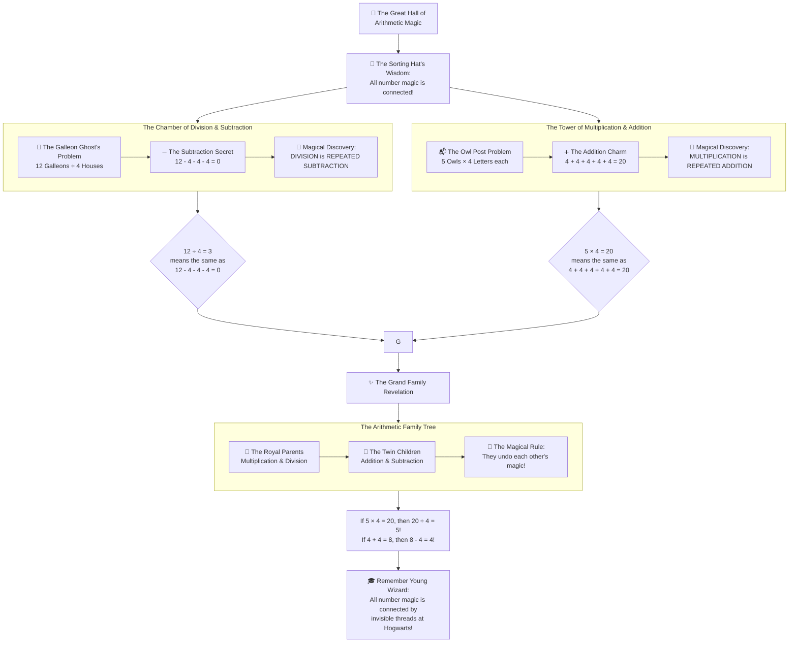

```mermaid
flowchart TD
    A["🏰 The Great Hall of<br/>Arithmetic Magic"] --> B["🎩 The Sorting Hat's Wisdom:<br/>All number magic is connected!"]
    
    B --> C
    subgraph C [The Chamber of Division & Subtraction]
        C1["👻 The Galleon Ghost's Problem<br/>12 Galleons ÷ 4 Houses"]
        C2["➖ The Subtraction Secret<br/>12 - 4 - 4 - 4 = 0"]
        C3["🔁 Magical Discovery:<br/>DIVISION is REPEATED SUBTRACTION"]
        
        C1 --> C2 --> C3
    end
    
    C --> D{"12 ÷ 4 = 3<br/>means the same as<br/>12 - 4 - 4 - 4 = 0"}
    
    B --> E
    subgraph E [The Tower of Multiplication & Addition]
        E1["📬 The Owl Post Problem<br/>5 Owls × 4 Letters each"]
        E2["➕ The Addition Charm<br/>4 + 4 + 4 + 4 + 4 = 20"]
        E3["🔁 Magical Discovery:<br/>MULTIPLICATION is REPEATED ADDITION"]
        
        E1 --> E2 --> E3
    end
    
    E --> F{"5 × 4 = 20<br/>means the same as<br/>4 + 4 + 4 + 4 + 4 = 20"}
    
    D --> G
    F --> G
    
    G --> H["✨ The Grand Family Revelation"]
    
    H --> I
    subgraph I [The Arithmetic Family Tree]
        I1["👑 The Royal Parents<br/>Multiplication & Division"]
        I2["👯 The Twin Children<br/>Addition & Subtraction"]
        I3["💫 The Magical Rule:<br/>They undo each other's magic!"]
        
        I1 --> I2 --> I3
    end
    
    I --> J["If 5 × 4 = 20, then 20 ÷ 4 = 5!<br/>If 4 + 4 = 8, then 8 - 4 = 4!"]
    
    J --> K["🎓 Remember Young Wizard:<br/>All number magic is connected by<br/>invisible threads at Hogwarts!"]

    %% Styling for visual magic
    class A,B,H,K importantNode
    class C1,C2,C3 divisionSpells
    class E1,E2,E3 multiplicationSpells
    class I1,I2,I3 familyTree
    class D,F,J connectionNodes


```
