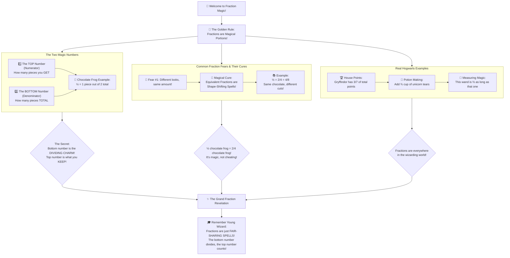

```mermaid

flowchart TD
    A["🏰 Welcome to Fraction Magic!"] --> B["🎩 The Golden Rule:<br/>Fractions are Magical Portions!"]
    
    B --> C
    subgraph C [The Two Magic Numbers]
        C1["1️⃣ The TOP Number<br/>(Numerator)<br/>How many pieces you GET"]
        C2["2️⃣ The BOTTOM Number<br/>(Denominator)<br/>How many pieces TOTAL"]
        C3["🍫 Chocolate Frog Example:<br/>½ = 1 piece out of 2 total"]
        
        C1 --> C3
        C2 --> C3
    end
    
    C --> D{"The Secret:<br/>Bottom number is the DIVIDING CHARM!<br/>Top number is what you KEEP!"}
    
    B --> E
    subgraph E [Common Fraction Fears & Their Cures]
        E1["🤔 Fear #1: Different looks, same amount!"]
        E2["🎯 Magical Cure:<br/>Equivalent Fractions are<br/>Shape-Shifting Spells!"]
        E3["📚 Example:<br/>½ = 2/4 = 4/8<br/>Same chocolate, different cuts!"]
        
        E1 --> E2 --> E3
    end
    
    E --> F{"½ chocolate frog = 2/4 chocolate frog!<br/>It's magic, not cheating!"}
    
    B --> G
    subgraph G [Real Hogwarts Examples]
        G1["🏆 House Points:<br/>Gryffindor has 3/7 of total points"]
        G2["🧪 Potion Making:<br/>Add ¾ cup of unicorn tears"]
        G3["📏 Measuring Magic:<br/>This wand is ⅔ as long as that one"]
        
        G1 --> G2 --> G3
    end
    
    G --> H{"Fractions are everywhere<br/>in the wizarding world!"}
    
    D --> I["✨ The Grand Fraction Revelation"]
    F --> I
    H --> I
    
    I --> J["🎓 Remember Young Wizard:<br/>Fractions are just FAIR-SHARING SPELLS!<br/>The bottom number divides, the top number counts!"]

    %% Styling for visual magic
    class A,B,I,J importantNode
    class C1,C2,C3 fractionComponents
    class E1,E2,E3 fearCures
    class G1,G2,G3 realExamples
    class D,F,H connectionNodes

```
